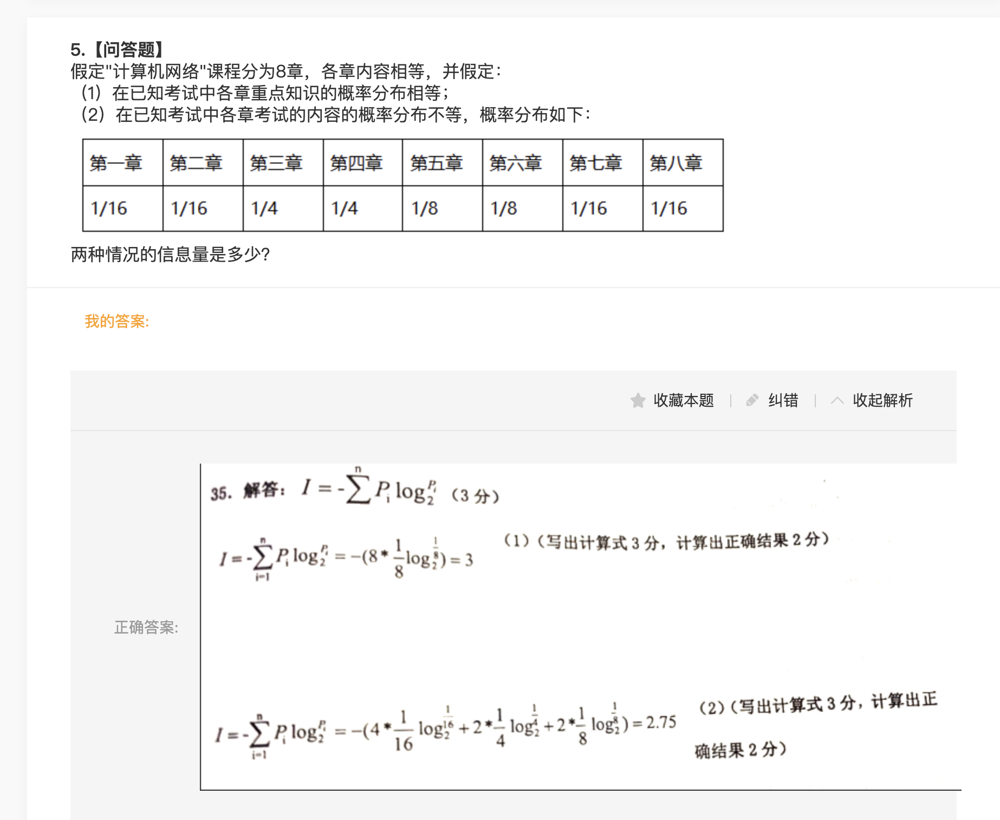

---
# 单独设置导航名称
nav: 信息资源建设
---

## 第1章 问答题与填空题

1. 知识地图主要包括面向程序的知识地图、面向概念的知识地图、面向能力的知识地图和面向社会关系的知识地图。
2. 按技术手段来划分，可以将信息资源管理的形成领域细分为数据管理和数据处理管理。
3. 信息资源管理标准化大体上可以细分为标准化技术、标准化设施、标准化术语和标准化管理过程。

4. 企业知识管理大致包括：企业员工基本知识素养的管理；知识的学习；知识的创造；建立企业知识支撑体系；知识工程等。
5. 国家信息化就是在国家统一规划和组织下，在农业、工业、科学技术、国防及社会生活各个方面应用现代信息技术，深入开发、广泛应用信息资源，加速国家实现信息化的进程。
6. 知识地图是一种知识导航系统，能够显示不同知识的存储之间动态联系，是知识管理输出模块。
7. 知识经济是建立在知识和信息基础之上的经济，以知识和信息的生产、分配和应用为直接依据的经济。
8. 广义的信息资源是信息和它的生产者以及信息技术的集合。包括三个部分：一是人类社会经济活动中经过加工处理有序化并大量积累后的有用信息的集合，二是为某种目的而生产有用信息的信息生产者的集合，三是加工、处理和传递有用信息的信息技术的集合。

## 第2章 问答题与填空题

1. 传播科学包括图书馆学、档案学，情报学和大众传播学等学科领域。

2. 目前ISO标准的编号方法是:标准代号+标准序号+发布年份。

3. 信息资源管理标准化的原则和方法：原则：效益原则；系统原则；动态原则；协商原则；优化原则。 方法：简化法；统一法；组合法；综合法；程序化法。

4. 信息论是信息科学的前导，它是应用数据统计方法研究信息的度量，传递和交换规律的一门科学，主要研究通信控制系统中普遍存在的信息传递共同规律以及研究演示信息的获取、度量、变换、存储，传递最佳途径等问题的基础理论。

5. 二次网络信息的组织方式主要有搜索引擎方式、指示数据库方法、数据库方式、荣单方式和主题树方式等。

6. 