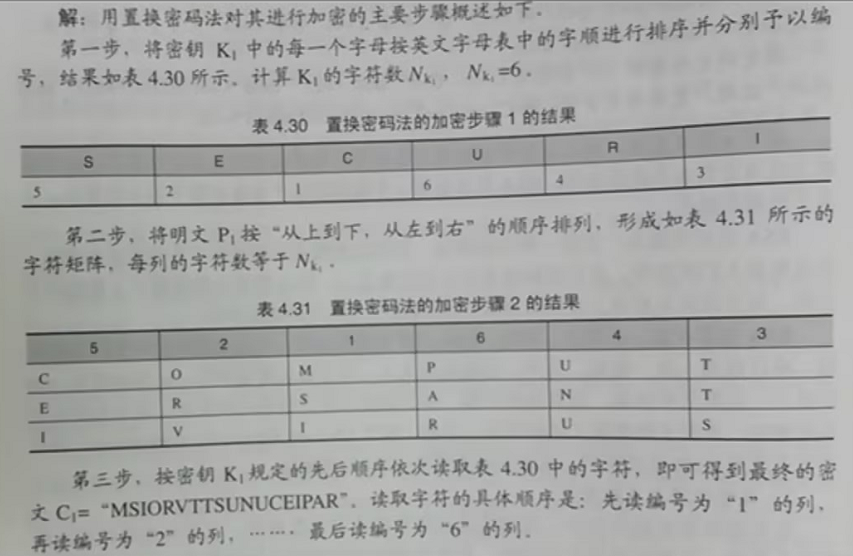
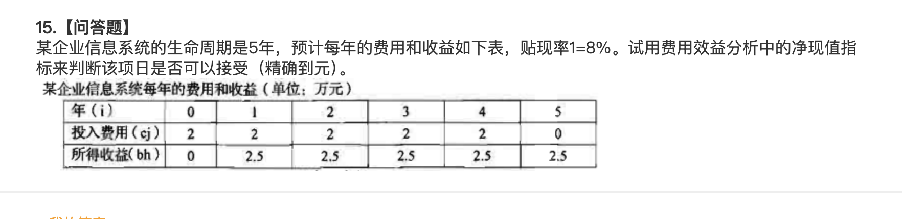
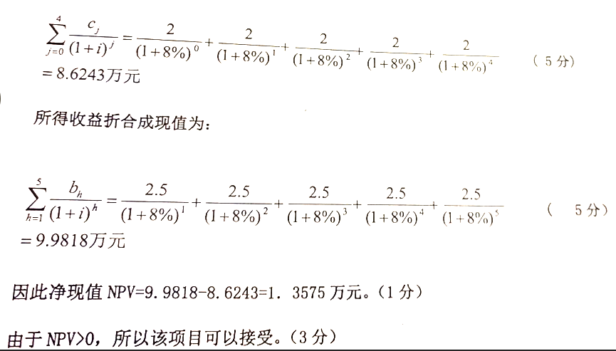

---
# 单独设置导航名称
nav: 信息资源建设
---

## 第1章 问答题与填空题

1. 知识地图主要包括面向程序的知识地图、面向概念的知识地图、面向能力的知识地图和面向社会关系的知识地图。
2. 按技术手段来划分，可以将信息资源管理的形成领域细分为数据管理和数据处理管理。
3. 信息资源管理标准化大体上可以细分为标准化技术、标准化设施、标准化术语和标准化管理过程。

4. 企业知识管理大致包括：企业员工基本知识素养的管理；知识的学习；知识的创造；建立企业知识支撑体系；知识工程等。
5. 国家信息化就是在国家统一规划和组织下，在农业、工业、科学技术、国防及社会生活各个方面应用现代信息技术，深入开发、广泛应用信息资源，加速国家实现信息化的进程。
6. 知识地图是一种知识导航系统，能够显示不同知识的存储之间动态联系，是知识管理输出模块。
7. 知识经济是建立在知识和信息基础之上的经济，以知识和信息的生产、分配和应用为直接依据的经济。
8. 广义的信息资源是信息和它的生产者以及信息技术的集合。包括三个部分：一是人类社会经济活动中经过加工处理有序化并大量积累后的有用信息的集合，二是为某种目的而生产有用信息的信息生产者的集合，三是加工、处理和传递有用信息的信息技术的集合。

## 第2章 问答题与填空题

1. 传播科学包括图书馆学、档案学，情报学和大众传播学等学科领域。

2. 目前ISO标准的编号方法是:标准代号+标准序号+发布年份。

3. 信息资源管理标准化的原则和方法：原则：效益原则；系统原则；动态原则；协商原则；优化原则。 方法：简化法；统一法；组合法；综合法；程序化法。

4. 信息论是信息科学的前导，它是应用数据统计方法研究信息的度量，传递和交换规律的一门科学，主要研究通信控制系统中普遍存在的信息传递共同规律以及研究演示信息的获取、度量、变换、存储，传递最佳途径等问题的基础理论。

5. 二次网络信息的组织方式主要有搜索引擎方式、指示数据库方法、数据库方式、荣单方式和主题树方式等。

6. 

### 第3章 问答题与填空题

7. 标准化是在经济、技术、科学及管理等社会实践中，对重复性事物和概念通过制定、发布和实施标准，达成统一，以获得秩序和社会效益。

8. 人力资源管理是指组织为了获取、开发人力资源所实施的一系列管理活动的总称。

### 第4章 问答题与填空题

1. 审计报告一般包括审计概况、审计范围、审计过程发现的问题和审计结论等内容。

2. 网络信息资源评价的自动评价法主要是利用计数器、缓存和ip地址作为网站分析。

3. 信息系统审计有监督、评价和鉴证三项职能。

4. 内部收益率是指在信息系统项目方案的生命周期内，当效益现值和费用现值相等时的折现率。

5. 软件质量是与软件产品满足规定的和隐含的需求能力有关的全部特征和特性。

6. 在可信计算机系统评审准则中,计算机系统安全性最高的是等级（A）。

7. 信息系统项目的计划管理的项目计划步骤为: 产义产品；确定任务；建立逻辑关系图；为任务分配时间；确定项目组成成员可支配的时间；为任务分配资源并进行平衡；确定管理支持性任务；准备计划汇总。

8. 假设明文P1为“ COMPUTERSANTIVIRUS”,密钥K1为“ SECURI”,请使用置换密码法对其进行加密(基于字母的字典顺序),写出主要的步骤。如下图:

9. TQM全面质量管理，一个组织以质量为中心，以全员参与为基础，目的在于通过顾客满意和本组织成员以及社会受益而达到长期成功管理途径。

10. 身份认证是确保计算机网络信息系统安全的关键和主要实现手段。

11. 信息系统的各个环节中都可能存在不安全因素，（1）数据输入部分；（2）数据处理部分；（3）通信线路；（4）软件部分；（5）输出部分；（6）存取控制部分。（每个要点1分，共6分）。

12. 项目管理是在一定的约束条件下，为了高效率的实现项目目标，按照项目的内在规律和程序，对项目的全过程进行有效的计划、组织、领导和控制的系统管理活动。

13. 信息系统审计的含义有：（1）信息系统运行审计，即对信息系统支持的业务信息或者业务数据进行审计，以验证其准确性和真实性；（2）利用计算机和信息系统作为工具，辅助审计工作；（3）信息系统开发审计，即对信息系统开发过程进行审计。（每个要点2分）

14. 信息资源的特征分为经济性特征和信息资源独有特征两种。（2分）（1）经济性特征；①需求性；②稀缺性；③可选择性。（2分）（2）独有特征：①共享性；②不可分性；③不同一性；④驾驭性；⑤动态性。（2分）

15. CRM客户关系管理，是指选择和管理有价值客户以及关系的一种商业策略，CRM要求以客户为中心的商业哲学和企业文化来支持有效的市场营销、销售及服务流程。

16. HTML是一种用来描述文档结构的语言，不能用来描述文档的实际表现形式。

17. VPN技术是使分布在不同地方的专用网络在不可信任的公共网络上实现安全通信的网络技术。

18. 项目管理的内容主要包括：任务划分、计划安排、经费管理、审计与控制、风险管理等主要内容。（5分）管理流程包括：立项与可行性研究、项目实施管理两个阶段。（2分）

19. 全面质量管理的基本要求：主要可以概括为“三全一多样”。（1分）“三全”指全员工的质量管理：（1分）全过程的质量管理；（2分）全企业的质量管理：（2分）“一多样”指多方法的质量管理。（1分）

### 第5章

1. 信息系统的生命周期可以分为系统规划，系统分析、系统设计、系统实施、系统运行和维护五个阶段。

### 第6章

1. 政府信息资源是一切产生于政府内部或虽然产生于政府外部但却对政府业务活动有影响的信息的统称。

2. 企业信息资源管理是企业所获得的能够反映客观事物的各种信息和知识的总称,是企业拥有的无形资产之一。

3. 政府信息资源分析；政府信息资源采集；政府信息资源组织；政府信息资源加工；政府信息资源检索；政府信息资源开发利用。

4. 企业信息资源管理的任务是：对企业中信息资源的开发利用进行总体规划；组建信息资源管理机构，并进行信息技 术、设备和人员的配置、维护和培训；负责组织企业管理信息系统的规划、开发、运行、 维护和管理；建立和维护整个组织中的数据信息标准规范和管理；对信息资源的新技术和 方法进行跟踪研究，应用于组织的信息管理；负责组织内部所有信息资源的安全和保密工 作；向组织中的所有部门提供信息资源的咨询、服务和维护；综合利用信息资源辅助组织 的高层决策。 企业信息资源管理的主要作用是： 加强企业信息资源管理是企业实现科学化管理和正确决策的需要；是增强企业竞争能 力的重要途径；有助于企业提高经济效益；是企业摆脱困境的有效手段。

5. 政府信息资源的保密其实质是在国家法律保护下的一种信息资源垄断措施。

6. ERP系统以企业的供应链管理为核心，以业务流程为导向，打破了各企业部之间的相互独立。

7. 二次网络信息的组织方式主要有搜索引擎方式、指示数据库方法、数据库方式、荣单方式和主题树方式等。

8. 身份认证技术的3A指的是认证、授权和计账。

9. 微信和支付宝是目前应用最广泛的电子结算方式。

10. 定题服务是指信息服务机构根据用户对某一专题的特定需求，输入计算机建立需求档案，定期对新到的资料进行检索，然后将检索结果随时提供给用户使用。

11. 政府信息资源内容管理的基本过程：（1）政府信息资源分析；（2）政府信息资源采集；（3）政府信息资源组织；（4）政府信息资源加工；（5）政府信息资源检索；（6）开发利用。

12. 网络信息资源管理要从建立网络法规、运用技术手段、注重技术人员的培养以及建立信息资源管理系统等方面进行。

13.  